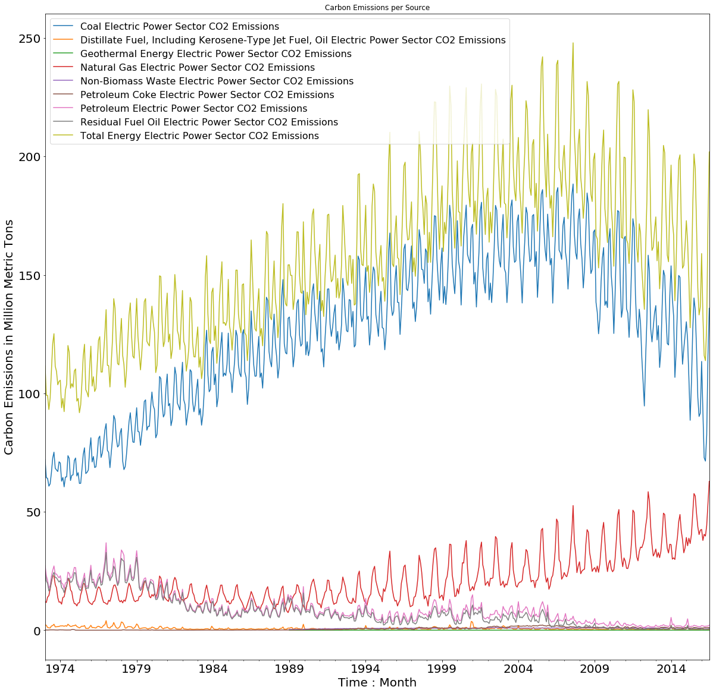
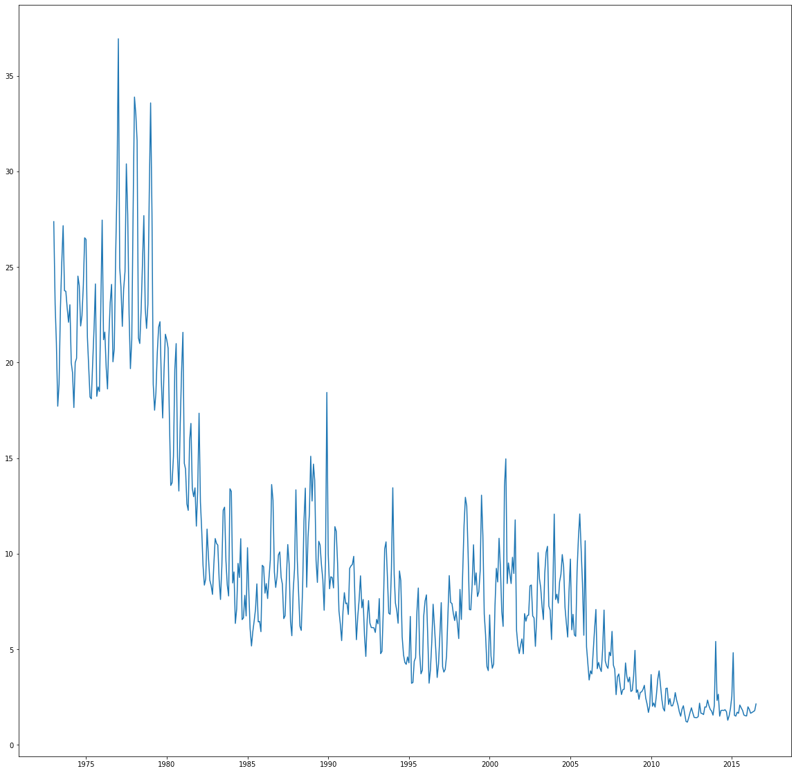
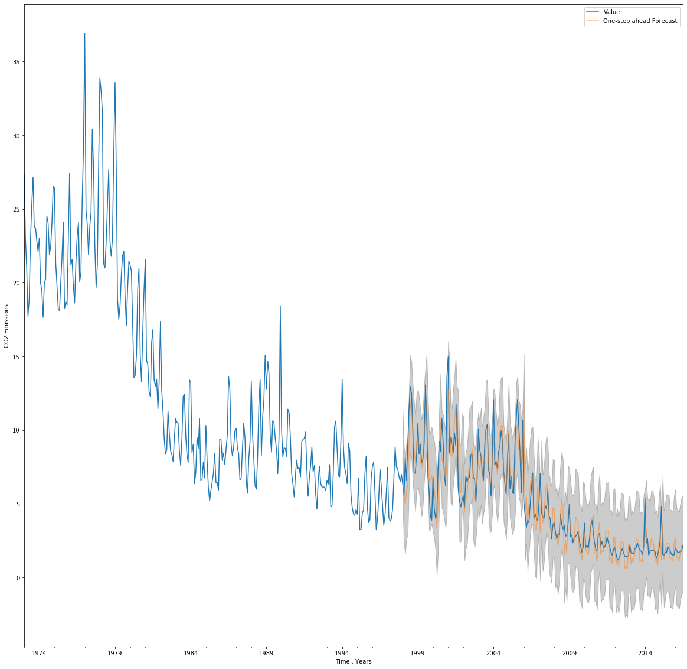

# Time Series CO2 Forecasting

Carbon dioxide emissions are one of the biggest causes of global warming, and their consequences are getting serious over time. The objectives of our study were to determine, using an ARIMA model over the time series of the carbon dioxide emission from electricity generation by petroleum emission, forecasting of emission

 
# Data

[Carbon emissions from electicity production](https://www.kaggle.com/txtrouble/carbon-emissions) is a Monthly/Annual carbon dioxide emissions from electricity generation from the Energy Information Administration. Data is broken down by fuel type.

### Carbon dioxide emissions from electricity generation :

 

### Carbon dioxide emission by petroleum emission :

 

### Prediction result :

